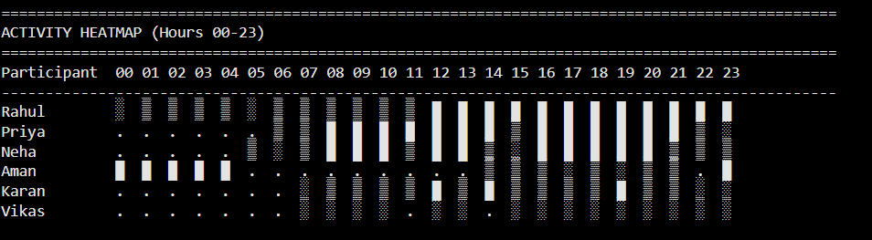
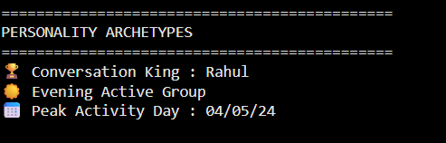
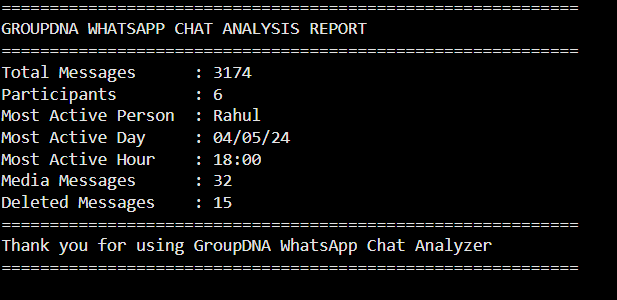

# GroupDNA WhatsApp Chat Analyzer

A Python-based WhatsApp Chat Analyzer developed as part of the GroupDNA Internship.

## Features

- Parse WhatsApp chat exports
- Count total messages
- Identify the most active participant
- Find the most active day and hour
- Count media and deleted messages
- Activity Heatmap
- Personality Archetypes
- Final Chat Analysis Report

## Technologies Used

- Python
- NumPy
- Google Colab

## Author

**Veeralakshmi Gunti**

## Output Screenshots

### Activity Heatmap

---

### Personality Archetypes

---

### Final Chat Analysis Report

